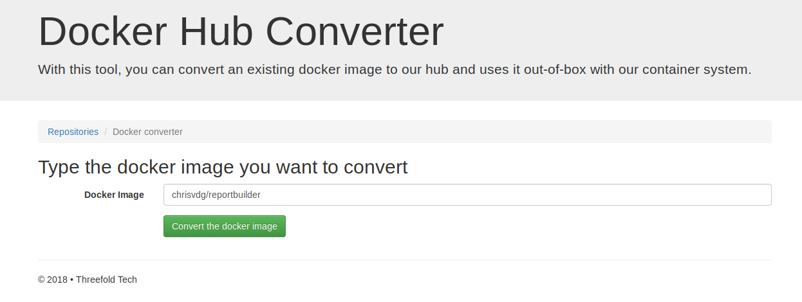
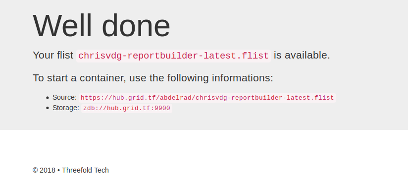

# Setting up a Sandbox using an flist and getting a capacity report

## Generate flist using the build script

The [reportbuilder.py](reportbuilder.py) script included in this repository can create a docker image with JS9 installed and the capacity report dependencies and push it to a docker hub repository.

To use the script:
```sh
# Push is enabled, image will be pushed to the chrisvdg/reportbuilder docker hub repository
# For adding tags, use e.g.: --image chrisvdg/reportbuilder:latest
python3 reportbuilder.py --push --image chrisvdg/reportbuilder
```

After the script has completed successfully run and the image is pushed, an flist from that image can be created on https://hub.gig.tech/docker-convert.





The flist is now ready for use!

## Set up a sandbox using flist

In this guide, [zbundle](https://github.com/zero-os/0-bundle) will be used to run the sandbox.

To install zbundle, check out the [zbundle install guide here](zbundle.md)

Run zbundle with previously created flist.
```sh
zbundle --id ubu \
    --no-exit  \
    --entry-point /bin/bash \
    https://hub.gig.tech/chris_van%20de%20gejuchte_1/chrisvdg-reportbuilder-latest.flist

```

To explain the added arguments:
* id: ID of the sandbox
* no-exit: The sandbox now immediately exits after creation. To prevent it from exiting and deleting the sandbox, this flag is used to keep it open. To exit the sandbox, press `ctrl + c` twice.
* entry-point: entry point of the sandbox
* [url]: location of the flist

## Access sandbox

To access the sandbox, open a new terminal window and chroot into the sandbox.
```sh
chroot /tmp/zbundle/ubu
```

The terminal should now be inside the sandbox and Jumpscale should be available
```
root@machine:/# js9
* ***Application started***: jsshell
Python 3.5.2 (default, Nov 23 2017, 16:37:01) 
Type 'copyright', 'credits' or 'license' for more information
IPython 6.3.1 -- An enhanced Interactive Python. Type '?' for help.

In [1]: 
```

## Get the capacity report

Using the [Ubuntu sal capacity property](https://github.com/Jumpscale/lib9/blob/development/docs/Howto/capacityreport_from_ubuntu.md) from Jumpscale, the capacity report can be fetched from the machine on which the sandbox is running.

```
# Print a prettified report
In [1]: report = j.sal.ubuntu.capacity.report(indent=2)
In [2]: print(report)
{
  "motherboard": [
    {
      "version": "A00",
      "asset_tag": "Not Specified",
      "serial": "/6N7NW32/CN129667780257/",
      "manufacturer": "Dell Inc.",
      "name": null
    }
  ],
  "disk": [
    {
      "model": null,
      "sector_size": null,
      "rotation_state": null,
      "name": "/dev/sr0",
      "type": "CDROM",
      "user_capacity": null,
      "device_id": null,
      "serial": null,
      "size": "1073741312",
      "firmware_version": null,
      "form_factor": null
    },
    {
      "model": "Micron 1100 SATA 256GB",
      "sector_size": "512 bytes logical, 4096 bytes physical",
      "rotation_state": "Solid State Device",
      "name": "/dev/sda",
      "type": "SSD",
      "user_capacity": "256,060,514,304 bytes [256 GB]",
      "device_id": "5 00a075 11712156c",
      "serial": "17161712156C",
      "size": "256060514304",
      "firmware_version": "M0DL003",
      "form_factor": "M0DL003"
    }
  ],
  "processor": [
    {
      "version": "Intel(R) Core(TM) i7-7500U CPU @ 2.70GHz",
      "id": "E9 06 08 00 FF FB EB BF",
      "thread_nr": "4",
      "manufacturer": "Intel(R) Corporation",
      "serial": "To Be Filled By O.E.M.",
      "core_nr": "2",
      "speed": "2600 MHz"
    }
  ],
  "memory": [
    {
      "size": "No Module Installed",
      "width": "Unknown",
      "asset_tag": "Not Specified",
      "serial": "Not Specified",
      "manufacturer": "Not Specified",
      "speed": "Unknown"
    },
    {
      "size": "16384 MB",
      "width": "64 bits",
      "asset_tag": "0F172300",
      "serial": "17594AB3",
      "manufacturer": "Micron",
      "speed": "2400 MHz"
    }
  ]
}
```
